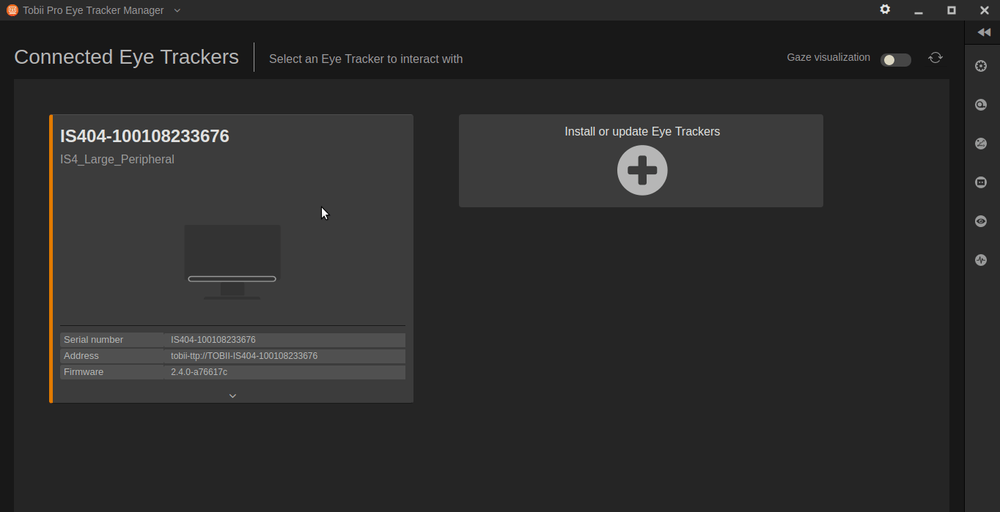
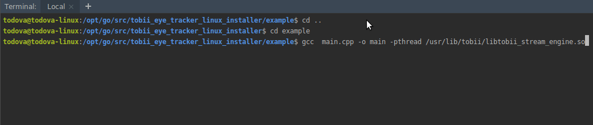

It allows to install the drivers and development libraries to operate devices compatible with IS4 (Tobii 4C).

The deps packages were obtained from the tobii page:
https://developer.tobii.com/consumer-eye-trackers/stream-engine/getting-started

The manager is obtained from:
https://www.tobiipro.com/es/learn--support/downloads/
(Changed to: https://www.tobiipro.com/product-listing/eye-tracker-manager/)

#### Instalation

bash ./install_all.sh

#### Configuration

Run the Tobii Pro Eye Tracker Manager:
/opt/TobiiProEyeTrackerManager/TobiiProEyeTrackerManager

Calibrate the device

#### Run the example code

cd example

gcc  main.cpp -o main -pthread /usr/lib/tobii/libtobii_stream_engine.so

./main

You will see how the tracker captures the position of the screen you are looking at

#### Test env:

SO: Ubuntu 18.10 x86_64 Cinnamon 4.18.0-17-generic

Tracker: Tobii

See:
https://github.com/Eitol/tobii_is4_x11

